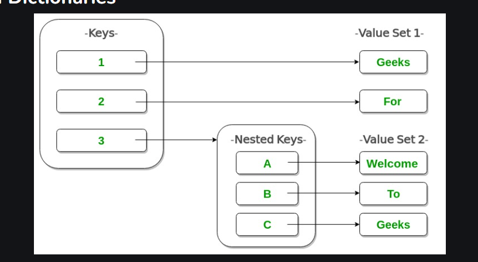

# Dictionaries In python

## A Python dictionary is a data structure that stores the value in key: value pairs.


## How to Create a Dictionary

### In Python, a dictionary can be created by placing a sequence of elements within curly {} braces, separated by a ‘comma’. The dictionary holds pairs of values, one being the Key and the other corresponding pair element being its Key:value. Values in a dictionary can be of any data type and can be duplicated, whereas keys can’t be repeated and must be immutable.


```python
Dict = {1: 'Geeks', 2: 'For', 3: 'Geeks'}
print(Dict)
```

## demonstrates creating dictionaries with different types of keys. 

```python
Dict = {1: 'Geeks', 2: 'For', 3: 'Geeks'}
print("\nDictionary with the use of Integer Keys: ")
print(Dict)

Dict = {'Name': 'Geeks', 1: [1, 2, 3, 4]}
print("\nDictionary with the use of Mixed Keys: ")
print(Dict)
```

## Different Ways to Create a Python Dictionary

```python
Dict = {}
print("Empty Dictionary: ")
print(Dict)

Dict = dict({1: 'Geeks', 2: 'For', 3: 'Geeks'})
print("\nDictionary with the use of dict(): ")
print(Dict)

Dict = dict([(1, 'Geeks'), (2, 'For')])
print("\nDictionary with each item as a pair: ")
print(Dict)
```
## Accessing Elements of a Dictionary
### To access the items of a dictionary refer to its key name. Key can be used inside square brackets.
```python
Dict = {1: 'Geeks', 'name': 'For', 3: 'Geeks'}
print("Accessing a element using key:")
print(Dict['name'])
print("Accessing a element using key:")
print(Dict[1])
```
## Nested Dictionaries



```python
Dict = {1: 'Geeks', 2: 'For',
        3: {'A': 'Welcome', 'B': 'To', 'C': 'Geeks'}}

print(Dict)
```

## Accessing an Element of a Nested Dictionary

```python
Dict = {'Dict1': {1: 'Geeks'},
        'Dict2': {'Name': 'For'}}

print(Dict['Dict1'])
print(Dict['Dict1'][1])
print(Dict['Dict2']['Name'])
```

## Deleting Elements using ‘del’ Keyword


```python
Dict = {1: 'Geeks', 'name': 'For', 3: 'Geeks'}

print("Dictionary =")
print(Dict)
del(Dict[1]) 
print("Data after deletion Dictionary=")
print(Dict)
```

# Dic Methods

## Python Dictionary clear()

```python
# Python program to demonstrate working of
# dictionary clear()
text = {1: "geeks", 2: "for"}

text.clear()
print('text =', text)
```

## Python Dictionary copy()
### Python Dictionary copy() method returns a shallow copy of the dictionary.

```python
original = {1: 'geeks', 2: 'for'}

# copying using copy() function
new = original.copy()

# removing all elements from the list
# Only new list becomes empty as copy()
# does shallow copy.
new.clear()

print('new: ', new)
print('original: ', original)
```
## Python Dictionary fromkeys() Method

### Python dictionary fromkeys() function returns the dictionary with key mapped and specific value. It creates a new dictionary from the given sequence with the specific value

```python
seq = ('a', 'b', 'c')
print(dict.fromkeys(seq, None))
```
```python
# Python3 code to demonstrate 
# to initialize dictionary with list 
# using from keys()

# using from keys() to construct
new_dict = dict.fromkeys(range(4), [])
	
# printing result
print ("New dictionary with empty lists as keys : " + str(new_dict))
```

## Python Dictionary get() Method

### Python Dictionary get() Method returns the value for the given key if present in the dictionary. If not, then it will return None (if get() is used with only one argument).

```python
d = {'coding': 'good', 'thinking': 'better'}
print(d.get('coding'))
```
```python
d = {1: '001', 2: '010', 3: '011'}

print(d.get(4, "Not found"))
```
```python
test_dict = {'Gfg' : {'is' : 'best'}}
  
# printing original dictionary
print("The original dictionary is : " + str(test_dict))
  
# using nested get()
# Safe access nested dictionary key
res = test_dict.get('Gfg', {}).get('is')
  
# printing result
print("The nested safely accessed value is :  " + str(res))
```
## Python Dictionary pop() Method
### Python dictionary pop() method removes and returns the specified element from the dictionary.

```python
# inializing dictionary student 
student = {"rahul":7, "Aditya":1, "Shubham":4} 

# priting original dictionary 
print(student) 

# using dictionary pop 
suspended = student.pop("rahul") 

# checking key of the element 
print("suspended student roll no. = "+ str(suspended)) 

# printing list after performing pop() 
print("remaining student" + str(student))
```
## Python Dictionary popitem() method
### Python dictionary popitem() method removes the last inserted key-value pair from the dictionary and returns it as a tuple.
```python
d = {1: '001', 2: '010', 3: '011'}
print(d.popitem())
```
## Python Dictionary update() method
### Python Dictionary update() method updates the dictionary with the elements from another dictionary object or from an iterable of key/value pairs.

```python
# Python program to show working
# of update() method in Dictionary

# Dictionary with three items
Dictionary1 = {'A': 'Geeks', 'B': 'For', }
Dictionary2 = {'B': 'Geeks'}

# Dictionary before Updation
print("Original Dictionary:")
print(Dictionary1)

# update the value of key 'B'
Dictionary1.update(Dictionary2)
print("Dictionary after updation:")
print(Dictionary1)
```

## Python Dictionary setdefault() Method
### Python Dictionary setdefault() returns the value of a key (if the key is in dictionary). Else, it inserts a key with the default value to the dictionary.


```python
my_dict = {'name': 'Alice', 'age': 25}

# Using setdefault to retrieve a value
age = my_dict.setdefault('age', 0)
print(f"Age: {age}")  # Output: Age: 25

# Using setdefault to add a new key with a default value
salary = my_dict.setdefault('salary', 50000)
print(f"Salary: {salary}")  # Output: Salary: 50000

print(my_dict)  # Output: {'name': 'Alice', 'age': 25, 'salary': 50000}
```
### The setdefault() method in Python dictionaries is a handy function that simplifies your code when you want to retrieve a value for a given key and also ensure that the key exists in the dictionary. If the key is already present, setdefault() returns its value. If the key is not present, it inserts the key with a specified default value and then returns that value.
