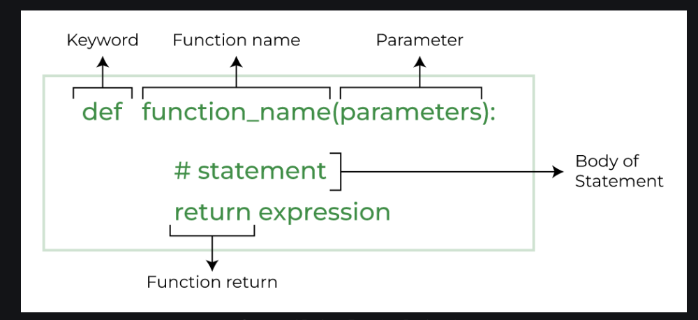

# Python Functions

### Python Functions is a block of statements that return the specific task. The idea is to put some commonly or repeatedly done tasks together and make a function so that instead of writing the same code again and again for different inputs, we can do the function calls to reuse code contained in it over and over again.

## Some Benefits of Using Functions

1. Increase Code Readability 


## syntax



# Types of Functions in Python

1. ### Built-in library function: These are Standard functions in Python that are available to use.
1. ### User-defined  function: We can create our own functions based on our requirements. 

## Creating a Function in Python

### We can define a function in Python, using the def keyword. We can add any type of functionalities and properties to it as we require. By the following example, we can understand how to write a function in Python. In this way we can create Python function definition by using def keyword.

```python
# A simple Python function
def fun():
    print("Welcome to GFG")
```
## Calling a Function in Python
### After creating a function in Python we can call it by using the name of the functions Python followed by parenthesis containing parameters of that particular function. Below is the example for calling def function Python

```python
# A simple Python function
def fun():
    print("Welcome to GFG")


# Driver code to call a function
fun()
```

# Parameters:
### A parameter is the variable defined within the parentheses during function definition. 
```python
# Here a,b are the parameters
def sum(a,b):
  print(a+b)
  
sum(1,2)
```
# Arguments:

### An argument is a value that is passed to a function when it is called. It might be a variable, value or object passed to a function or method as input. 
```python
def sum(a,b):
  print(a+b)
  
# Here the values 1,2 are arguments
sum(1,2)
```

# What is the difference between parameters and arguments in Python?
## Parameters are the variables listed inside the parentheses in the function definition.
## Arguments are the values passed to the function when it is called.


## Python Function with Parameters

## Syntax


```python
def add(num1: int, num2: int) -> int:
    """Add two numbers"""
    num3 = num1 + num2

    return num3

# Driver code
num1, num2 = 5, 15
ans = add(num1, num2)
print(f"The addition of {num1} and {num2} results {ans}.")
```

```python
def is_prime(n):
    if n <= 1:
        return False
    for i in range(2, int(n ** 0.5) + 1):
        if n % i == 0:
            return False
    return True
```  


# Python Function Arguments
### Arguments are the values passed inside the parenthesis of the function. A function can have any number of arguments separated by a comma.

```python
# A simple Python function to check
# whether x is even or odd
def evenOdd(x):
    if (x % 2 == 0):
        print("even")
    else:
        print("odd")


# Driver code to call the function
evenOdd(2)
evenOdd(3)
```

## Types of Python Function Arguments

### 1. Default Arguments
### 2. Positional Arguments
### 3. Keyword Arguments
### 4. Variable Length Arguments


# 1. Default Arguments

## A default argument is a parameter that assumes a default value if a value is not provided in the function call for that argument.
```python
# Python program to demonstrate
# default arguments
def myFun(x, y=50):
    print("x: ", x)
    print("y: ", y)


# Driver code (We call myFun() with only
# argument)
myFun(10)
```
# Important Note 
###  any number of arguments in a function can have a default value. But once we have a default argument, all the arguments to its right must also have default values.

# Positional Arguments:
### Positional Arguments are needed to be included in proper order i.e the first argument is always listed first when the function is called, second argument needs to be called second and so on.

```python
def person_name(first_name,second_name):
  print(first_name+second_name)
  
# First name is Ram placed first
# Second name is Babu place second
person_name("Ram","Babu")
```

```python
def nameAge(name, age):
    print("Hi, I am", name)
    print("My age is ", age)


# You will get correct output because 
# argument is given in order
print("Case-1:")
nameAge("Suraj", 27)
# You will get incorrect output because
# argument is not in order
print("\nCase-2:")
nameAge(27, "Suraj")
```
# Keyword Arguments:
### Keyword Arguments is an argument passed to a function or method which is preceded by a keyword and an equal to sign. The order of keyword argument with respect to another keyword argument does not matter because the values are being explicitly assigned.

```python
def person_name(first_name,second_name):
  print(first_name+second_name)

# Here we are explicitly assigning the values 
person_name(second_name="Babu",first_name="Ram")
```

# the difference between **keyword arguments** and **positional arguments** 

1. **Positional arguments**: These are passed in the order they are defined in the function. The position matters, so the first argument corresponds to the first parameter, the second to the second, and so on.

2. **Keyword arguments**: These are passed using the parameter names explicitly. The position does not matter; each argument is assigned to its corresponding parameter by name.


# Arbitrary Keyword  Arguments
## In Python Arbitrary Keyword Arguments, *args, and **kwargs can pass a variable number of arguments to a function using special symbols. There are two special symbols:

1. *args in Python (Non-Keyword Arguments)
1. **kwargs in Python (Keyword Arguments)
 
##  Example 1: Variable length non-keywords argument
```python
# Python program to illustrate
# *args for variable number of arguments
def myFun(*argv):
    for arg in argv:
        print(arg)


myFun('Hello', 'Welcome', 'to', 'GeeksforGeeks')
```
## Example 2: Variable length keyword arguments
```python
def myFun(**kwargs):
    for key, value in kwargs.items():
        print(f"{key} = {value}")


# Driver code
myFun(first='Geeks', mid='for', last='Geeks')


```

# Docstring
## The first string after the function is called the Document string or Docstring in short. This is used to describe the functionality of the function. The use of docstring in functions is optional but it is considered a good practice.
```python
print(function_name.__doc__)
```

## Anonymous Functions in Python
### In Python, an anonymous function means that a function is without a name. As we already know the def keyword is used to define the normal functions and the lambda keyword is used to create anonymous functions.
```python
# Python code to illustrate the cube of a number
# using lambda function
def cube(x): return x*x*x

cube_v2 = lambda x : x*x*x

print(cube(7))
print(cube_v2(7))
```
```python
add = lambda a, b: a + b
print(add(3, 5))  # Output: 8
```
## Python Function within Functions
### A function that is defined inside another function is known as the inner function or nested function. Nested functions can access variables of the enclosing scope. Inner functions are used so that they can be protected from everything happening outside the function.

```python
# Python program to
# demonstrate accessing of
# variables of nested functions

def f1():
    s = 'I love GeeksforGeeks'
    
    def f2():
        print(s)
        
    f2()

# Driver's code
f1()
```
```python
def outer_function(number):
    def square(n):
        return n * n
    return square(number)

# Call the outer function
result = outer_function(5)
print(result)  # Output: 25
```

In Python, you can have a **function inside another function**, and this is called a **nested function** or **inner function**. It’s like putting a small box inside a bigger box. The **inner function** can access the variables of the **outer function**, but the outer function can’t see inside the inner function. This is useful when you want to keep certain parts of your code protected or hidden from the outside.

### Real-Life Example:
Imagine you’re running a **restaurant** (the outer function), and inside the restaurant, you have a **kitchen** (the inner function). Only the chefs (the inner function) can access the ingredients in the kitchen, but customers (the outside world) can’t directly see or access what’s happening inside. The kitchen can still use whatever ingredients the restaurant has, but its operations stay hidden from the customers.

### Example in Python:

```python
def outer_function(text):
    # Outer function has a variable 'text'
    def inner_function():
        # Inner function can access 'text' from the outer function
        print(text)
    
    # Calling the inner function from within the outer function
    inner_function()

# Calling the outer function
outer_function("Hello from the outer function!")
```


### What’s Happening Here?
1. We define an **outer function** (`outer_function`) that takes a variable `text`.
2. Inside it, we define an **inner function** (`inner_function`) that can access `text` from the outer function.
3. When we call the outer function, it runs the inner function, which prints the text.

### Why Use Nested Functions?
1. **Protection**: Inner functions are protected from the outside world. They only exist inside the outer function, so nothing outside can change or access them.
   - Example: The kitchen (inner function) is hidden from the restaurant customers.
   
2. **Organized Code**: Nested functions help you organize your code by keeping certain parts private or limited in scope.

### Another Example:

```python
def outer_function(number):
    def square(n):
        return n * n
    return square(number)

# Call the outer function
result = outer_function(5)
print(result)  # Output: 25
```

Here, the inner function **`square`** is only used inside the **`outer_function`**, and it calculates the square of the number. You can’t access `square` from outside `outer_function`.

In summary, nested functions are like **secret helpers** inside a bigger function. They keep certain operations hidden and safe, while still being able to use everything from the outer function


## Recursive Functions in Python
Recursion in Python refers to when a function calls itself. There are many instances when you have to build a recursive function to solve Mathematical and Recursive Problems.

## Example: Factorial Using Recursion
Let’s look at the factorial of a number as an example. The factorial of a number (n!) is the product of all numbers from 1 to n. So 5! = 5 * 4 * 3 * 2 * 1.

#### Using recursion:

```python
def factorial(n):
    # Base Case: If n is 1, just return 1 (stop here)
    if n == 1:
        return 1
    # Recursive Case: Multiply n by factorial of (n-1)
    else:
        return n * factorial(n - 1)

# Call the function
print(factorial(5))  # Output: 120
```
1. Sum of Numbers Using Recursion
Let’s find the sum of numbers from 1 to n using recursion. Instead of adding all numbers at once, the function adds the current number to the sum of the previous numbers.

```python
def sum_of_numbers(n):
    # Base Case: If n is 1, return 1 (stop here)
    if n == 1:
        return 1
    # Recursive Case: Add the current number to the sum of previous numbers
    else:
        return n + sum_of_numbers(n - 1)

# Call the function
print(sum_of_numbers(5))  # Output: 15
```
