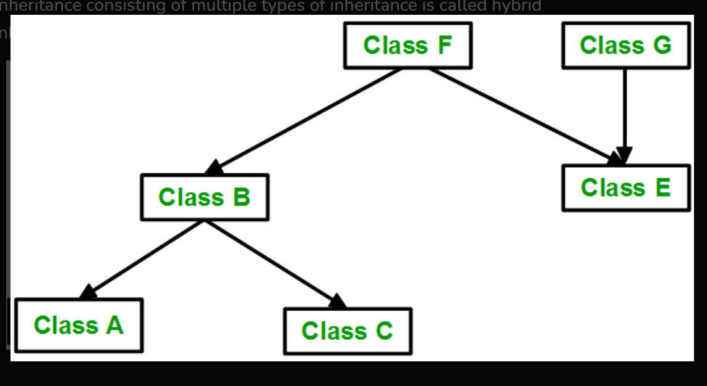

# Inheritance in Python

Inheritance is the capability of one class to derive or inherit the properties from another class
Inheritance allows us to create a new class from an existing class.

## Key Concepts

- **Subclass**: The new class that is created (child or derived class).
- **Superclass**: The existing class from which the child class is derived (parent or base class).


## Benefits of Inheritance

The benefits of inheritance in Python are as follows:

- Inheritance allows you to inherit the properties of a class, i.e., base class to another, i.e., derived class.
- It represents real-world relationships well.
- It provides the reusability of code; we don’t have to write the same code again and again.
- It allows us to add more features to a class without modifying it.
- It is transitive in nature, which means that if class B inherits from another class A, then all the subclasses of B would automatically inherit from class A.
- Inheritance offers a simple, understandable model structure.
- Less development and maintenance expenses result from inheritance.

```python
# A Python program to demonstrate inheritance
class Person(object):
  
  # Constructor
  def __init__(self, name, id):
    self.name = name
    self.id = id

  # To check if this person is an employee
  def Display(self):
    print(self.name, self.id)


class Emp(Person):
  
  def Print(self):
    print("Emp class called")
    
# Driver code
emp = Person("Satyam", 102) # An Object of Person
emp.Display()

Emp_details = Emp("Mayank", 103)

# calling parent class function
Emp_details.Display()

# Calling child class function
Emp_details.Print()
```

# Types of Inheritance

Types of inheritance depend upon the number of child and parent classes involved. There are five types of inheritance in Python:

1. **Single Inheritance**
2. **Multiple Inheritance**
3. **Multilevel Inheritance**
4. **Hierarchical Inheritance**
5. **Hybrid Inheritance**


## Single Inheritance

Single inheritance enables a derived class to inherit properties from a single parent class, thus enabling code reusability and the addition of new features to existing code.


```python
# Python program to demonstrate
# single inheritance

# Base class
class Parent:
	def func1(self):
		print("This function is in parent class.")

# Derived class


class Child(Parent):
	def func2(self):
		print("This function is in child class.")


# Driver's code
object = Child()
object.func1()
object.func2()
```
## Multiple Inheritance

When a class can be derived from more than one base class, this type of inheritance is called multiple inheritance. In multiple inheritance, all the features of the base classes are inherited into the derived class.


```python
# Python program to demonstrate
# multiple inheritance

# Base class1
class Mother:
	mothername = ""

	def mother(self):
		print(self.mothername)

# Base class2


class Father:
	fathername = ""

	def father(self):
		print(self.fathername)

# Derived class


class Son(Mother, Father):
	def parents(self):
		print("Father :", self.fathername)
		print("Mother :", self.mothername)


# Driver's code
s1 = Son()
s1.fathername = "RAM"
s1.mothername = "SITA"
s1.parents()
```
## Multilevel Inheritance

In multilevel inheritance, features of the base class and the derived class are further inherited into the new derived class. This is similar to a relationship representing a child and a grandfather.


```python
# Python program to demonstrate
# multilevel inheritance

# Base class


class Grandfather:

	def __init__(self, grandfathername):
		self.grandfathername = grandfathername

# Intermediate class


class Father(Grandfather):
	def __init__(self, fathername, grandfathername):
		self.fathername = fathername

		# invoking constructor of Grandfather class
		Grandfather.__init__(self, grandfathername)

# Derived class


class Son(Father):
	def __init__(self, sonname, fathername, grandfathername):
		self.sonname = sonname

		# invoking constructor of Father class
		Father.__init__(self, fathername, grandfathername)

	def print_name(self):
		print('Grandfather name :', self.grandfathername)
		print("Father name :", self.fathername)
		print("Son name :", self.sonname)


# Driver code
s1 = Son('Prince', 'Rampal', 'Lal mani')
print(s1.grandfathername)
s1.print_name()
```
## Hierarchical Inheritance

When more than one derived class is created from a single base, this type of inheritance is called hierarchical inheritance. In this program, we have a parent (base) class and three child (derived) classes.


```python
# Python program to demonstrate
# Hierarchical inheritance


# Base class
class Parent:
	def func1(self):
		print("This function is in parent class.")

# Derived class1


class Child1(Parent):
	def func2(self):
		print("This function is in child 1.")

# Derivied class2


class Child2(Parent):
	def func3(self):
		print("This function is in child 2.")


# Driver's code
object1 = Child1()
object2 = Child2()
object1.func1()
object1.func2()
object2.func1()
object2.func3()
```
## Hybrid Inheritance

Inheritance consisting of multiple types of inheritance is called hybrid inheritance.



