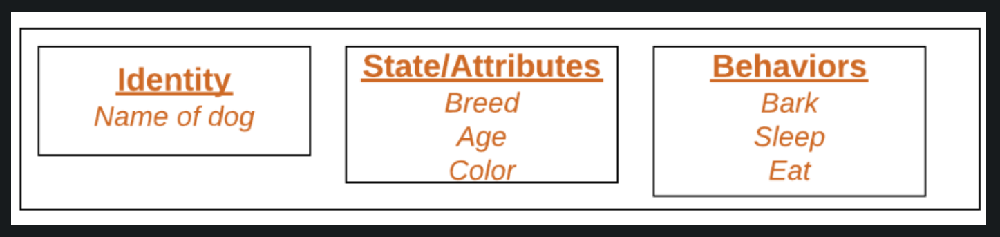
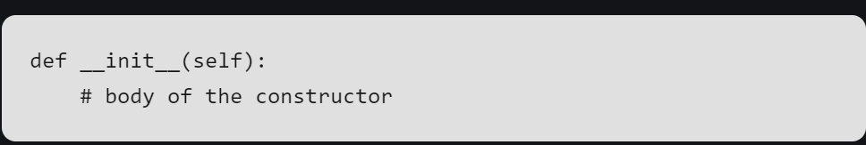

# OOP

## Class

#### Class creates a user-defined data structure, which holds its own data members and member functions, which can be accessed and used by creating an instance of that class. A class is like a blueprint for an object.

# Some points on Python class: 

#### Classes are created by keyword class. Attributes are the variables that belong to a class. Attributes are always public and can be accessed using the dot(.) operator. Eg.: Myclass.Myattribute


## Let's break this down into simpler words:

A **class** is like a plan or template that lets you create your own custom data structure. This structure can store its own information (called **data members**) and actions or functions (called **member functions**). You can use these by making an **instance** (or object) of that class. So, think of a class as a blueprint to create objects, like a house blueprint that helps build actual houses.

## Real-Life Example:
Think of a class as a **blueprint** for a car. The blueprint tells you the car's parts and features (like color, wheels, and speed). But you can't drive the blueprint itself! You have to **build a car** from that blueprint. The car you build is like an **object** or **instance** of the class. Each car (object) built from the same blueprint can have its own color and speed, but all follow the same plan.

### Key Points in Python:
- **Classes** are made using the keyword `class`.
- Inside a class, **attributes** are the variables that store information. For example, if you create a "Car" class, an attribute could be "color" or "speed."
- These attributes can be accessed by using the dot (`.`) operator. So, if your class is called "Car" and your attribute is "color," you'd write it like this: `Car.color`. 


## Class Objects

An Object is an instance of a Class. A class is like a blueprint while an instance is a copy of the class with actual values. It’s not an idea anymore, it’s an actual dog, like a dog of breed pug who’s seven years old. You can have many dogs to create many different instances, but without the class as a guide, you would be lost, not knowing what information is required.

# An object consists of : 

### State: It is represented by the attributes of an object. It also reflects the properties of an object.

### Behavior: It is represented by the methods of an object. It also reflects the response of an object to other objects.

### Identity: It gives a unique name to an object and enables one object to interact with other objects.

## Let’s make this simpler!

An **object** is a **specific version** of a class. Think of a **class** as a general plan or idea, while an object is a real thing created from that plan. For example, a class might describe what all dogs have in common (like breed, age, color), and an object would be a **specific dog** (like a 7-year-old pug). Each object has its own details, but it follows the plan of the class.

### Real-Life Example:
Imagine you’re making cookies. The **class** is like the **cookie cutter**—it shapes the cookies. The **object** is the actual **cookie** you make using the cutter. Each cookie (object) is made using the same cutter (class), but once the cookies are baked, each one can have different toppings (like sprinkles, icing), just like each object can have different values.

### Key Parts of an Object:
1. **State**: This is the object’s **attributes** or properties. It’s what makes the object unique. 
   - Example: A dog’s state could be its **breed** (pug), **age** (7 years), or **color** (brown).
  
2. **Behavior**: This is what the object can **do**. These are called **methods** or functions.
   - Example: A dog’s behavior might be to **bark**, **run**, or **eat**.

3. **Identity**: This is the unique identifier that tells one object apart from another.
   - Example: Even if two dogs have the same breed and age, they are still two different dogs, and their identity (like a **name** or **microchip ID**) helps you tell them apart.

In Python, each object you create from a class has its own **state**, **behavior**, and **identity**, making it a unique item based on the class's blueprint!



## Declaring Objects (Also called instantiating a class)

When an object of a class is created, the class is said to be instantiated. All the instances share the attributes and the behavior of the class. But the values of those attributes, i.e. the state are unique for each object. A single class may have any number of instances.


```python
class Dog:
    def __init__(self, breed, age, color):
        self.breed = breed
        self.age = age
        self.color = color

    def bark(self):
        print("Woof! Woof!")

    def sleep(self):
        print("Zzz... Sleeping...")

    def eat(self, food):
        print(f"Yum! I love {food}!")

# Example of creating instances and calling methods
dog1 = Dog("Labrador", 5, "black")
dog2 = Dog("Beagle", 2, "brown")

dog1.bark()
dog2.sleep()
dog1.eat("chicken")
```


# Class and Instance Variables

Instance variables are for data, unique to each instance and class variables are for attributes and methods shared by all instances of the class. Instance variables are variables whose value is assigned inside a constructor or method with self whereas class variables are variables whose value is assigned in the class.

```python
# Python3 program to show that the variables with a value 
# assigned in the class declaration, are class variables and
# variables inside methods and constructors are instance
# variables.

# Class for Dog
class Dog:

    # Class Variable
    animal = 'dog'

    # The init method or constructor
    def __init__(self, breed, color):

        # Instance Variable
        self.breed = breed
        self.color = color

# Objects of Dog class
Rodger = Dog("Pug", "brown")
Buzo = Dog("Bulldog", "black")

print('Rodger details:')
print('Rodger is a', Rodger.animal)
print('Breed: ', Rodger.breed)
print('Color: ', Rodger.color)

print('\nBuzo details:')
print('Buzo is a', Buzo.animal)
print('Breed: ', Buzo.breed)
print('Color: ', Buzo.color)

# Class variables can be accessed using class
# name also
print("\nAccessing class variable using class name")
print(Dog.animal)
```

## Constructor 
Constructors are generally used for instantiating an object. The task of constructors is to initialize(assign values) to the data members of the class when an object of the class is created. In Python the __init__() method is called the constructor and is always called when an object is created.
 ## Syntax of constructor declaration : 



Let’s simplify this concept!

**Constructors** are special methods used to set up or prepare an object when it is created. Think of a constructor like a **welcome kit** you get when you check into a hotel room. The hotel staff gives you everything you need for your stay, such as towels, water, and snacks. Similarly, the constructor provides all the values or setup information an object needs when it’s created.

In Python, the constructor is the **`__init__()` method**. Whenever you create a new object, this method is automatically called to assign values to the object’s attributes (or properties). It's like a set of instructions for the object to get ready for use.

### Real-Life Example:
Imagine you’re creating a new **car** (an object). When the car is made, you want to give it some initial information, like its color, model, and fuel level. The constructor handles this by "initializing" these values.

### Example in Python:

```python
class Car:
    def __init__(self, color, model, fuel_level):
        # These are the attributes of the car
        self.color = color
        self.model = model
        self.fuel_level = fuel_level

# Creating a car object
my_car = Car("red", "Toyota", 100)

# Accessing attributes
print(my_car.color)  # Output: red
print(my_car.model)  # Output: Toyota
print(my_car.fuel_level)  # Output: 100
```

### Key Points:
1. **Initialization**: The constructor (`__init__()`) is used to initialize the attributes of an object when it is created.
2. **Automatic Call**: The `__init__()` method is called automatically when a new object is made, so you don’t have to call it manually.
3. **Customization**: You can customize what values the object gets when it’s created, like giving a car its color, model, and fuel level right away.

So, constructors are like the **starting setup** that gives an object its initial values when it’s created!

# Self parameter


## The self keyword in Python is used to represent an instance (object) of a class. It allows you to access attributes and methods of the class in Python. It must be the first parameter of any method in the class, including the __init__ method, which is the constructor
## Self represents the instance of the class. By using the “self”  we can access the attributes and methods of the class in Python. It binds the attributes with the given arguments. 

### Whenever you call a method on an object, Python automatically sends the object itself as the first argument using self. This allows you to change that object’s attributes (its data) or perform actions specific to that object.
## When we call a method of this object as myobject.method(arg1, arg2), this is automatically converted by Python into MyClass.method(myobject, arg1, arg2) – this is all the special self is about.

# Real-Life Example:
#### Imagine you’re in a class with 30 students. Each student can speak, but they need to know which student is speaking. Here, self is like the student saying "I am John" or "I am Sarah." Without self, it would be confusing to know who’s talking! 

# Real-Life Example:
#### Imagine you have a remote control for your TV. If you press the "volume up" button, the remote sends a signal to your TV (not someone else’s TV!). The TV understands that the signal is for itself. Here, self is like the TV knowing the signal is meant for it and not for another TV.

```python
class TV:
    def __init__(self, brand, volume):
        # 'self' refers to the specific TV object
        self.brand = brand
        self.volume = volume

    def increase_volume(self):
        # Use 'self' to modify the volume of this TV
        self.volume += 1
        print(f"The volume of {self.brand} TV is now {self.volume}.")

# Creating a TV object
my_tv = TV("Samsung", 10)

# Increasing the volume of my_tv
my_tv.increase_volume()  # Output: The volume of Samsung TV is now 11.
```

# Destructor
## Destructors are called when an object gets destroyed. In Python, destructors are not needed as much as in C++ because Python has a garbage collector that handles memory management automatically. 
## The __del__() method is a known as a destructor method in Python. It is called when all references to the object have been deleted i.e when an object is garbage collected.  

Let’s simplify that!

A **destructor** is a special method that gets called when an object is about to be destroyed. It’s like saying goodbye to an object before it’s completely removed from memory. In Python, you don’t usually need to worry about destructors as much as in languages like C++, because Python has something called a **garbage collector**. This garbage collector automatically takes care of cleaning up objects that are no longer being used, so you don’t have to manually destroy them.

The destructor in Python is the **`__del__()` method**. It gets called when an object is about to be deleted, meaning when Python’s garbage collector decides it’s no longer needed.

### Real-Life Example:
Imagine you’re renting a car. When you’re done with the car and return it, the car rental company takes care of cleaning and preparing it for the next customer. In this case, **`__del__()`** is like the company doing the final cleanup when you return the car. You don’t worry about the process—it just happens.

### Example in Python:

```python
class Car:
    def __init__(self, brand):
        self.brand = brand
        print(f"{self.brand} car is created.")

    def __del__(self):
        # Destructor method
        print(f"{self.brand} car is being destroyed.")

# Creating an object of Car
my_car = Car("Toyota")

# Deleting the object
del my_car  # Output: "Toyota car is being destroyed."
```

### What’s Happening Here:
1. **`__init__()` creates the object**: When you create a `Car` object, it’s like making a new car. In this case, a Toyota car.
2. **`__del__()` destroys the object**: When you delete the car object using `del`, the `__del__()` method is called, cleaning up the object (like the car being returned to the rental company).

### Key Points:
1. **Destructors Clean Up**: `__del__()` is used for cleanup actions when an object is about to be removed.
2. **Automatic Memory Management**: Python’s garbage collector handles most of the memory management, so you rarely need to use destructors yourself.
3. **Called When Object Is Deleted**: The destructor is only called when there are no more references to the object, meaning Python knows it’s time to remove it.

In short, destructors in Python are like a final cleanup process before an object is removed, but Python usually handles this automatically for you!


# The four pillars of OOP are:

1. Encapsulation
2. Abstraction
3. Inheritance
4. Polymorphism


